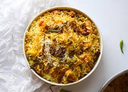

# Sathyanarayana Mallipudi

My favorite food is Chicken Biryani. It is a favourite for all Indians.
It contains chicken cooked slowly with various spices.

---
### Restaurants
Below is a list of some great restaurants that I recommend.

| Restaurant  | Reason to Recommend    | Location  |
|-------------|----------------------- |-----------|
| ShahGouse   | Great Mutton Biryani   | Hyderabad |
| Meghana's   | Great Boneless Biryani | Bengaluru |
| Bawarchi    | Oldest place, serves Good food | Hyderabad |
| Pista House | Zafrani Biryani | Hyderabad |

---

> I'm a huge fan of whiteboards, they are re-markable!
*Demetri Martin*

> A book is like a baby, you can't really enjoy it until it's finished.
*Jerry Seinfield*

---
### Code Snippet

'''sql
SELECT column_name(s)
FROM table_name
WHERE column_name BETWEEN value1 AND value2;

Source: [SQL Code Snippet](https://code.pieces.app/collections/sql)